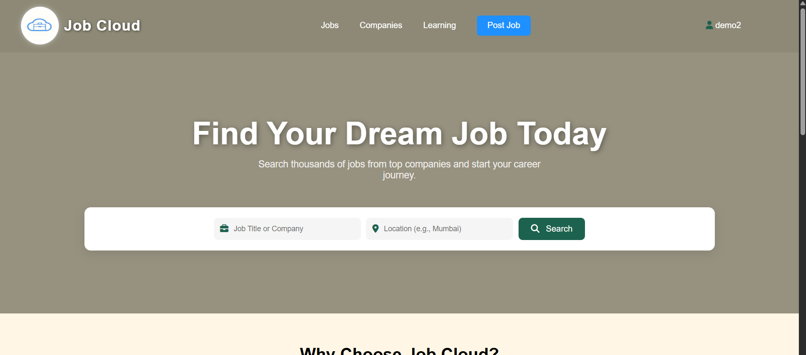
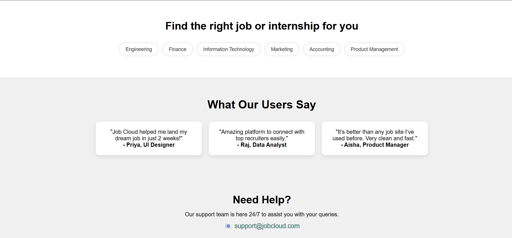
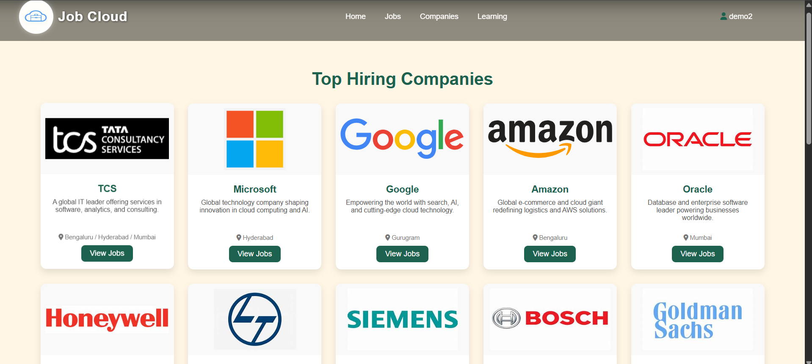
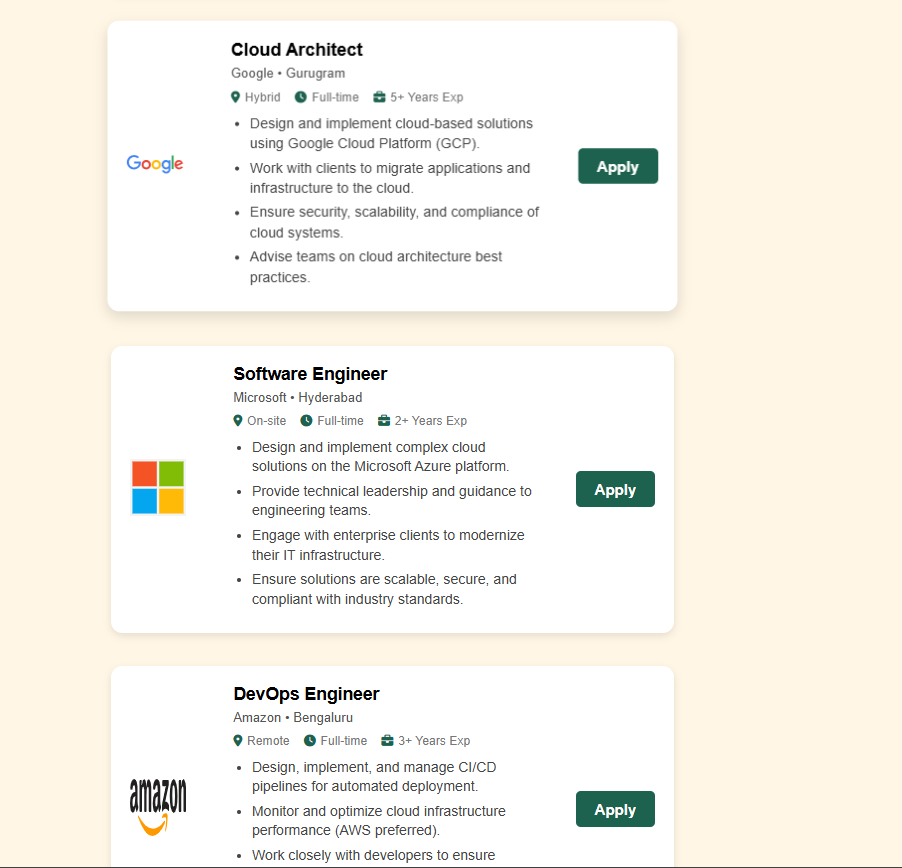
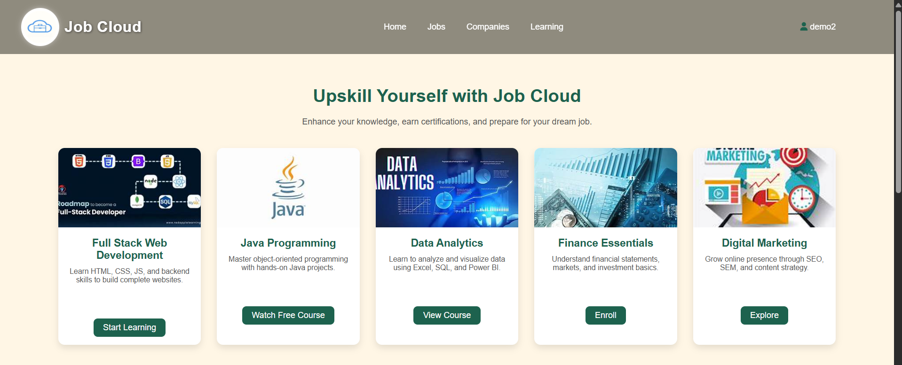
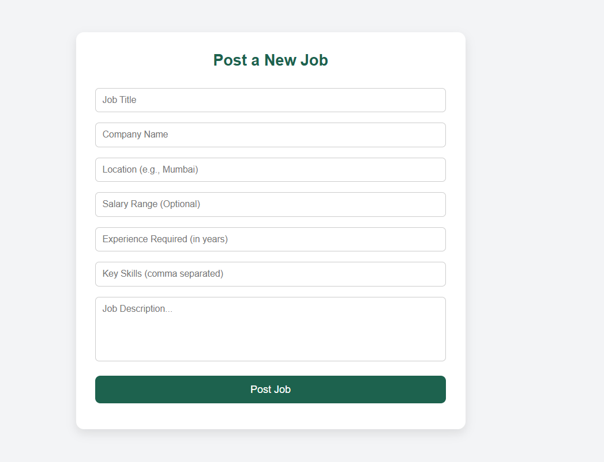

# 💼 Job Cloud

<div align="center">

### Cloud-Based Job Portal for Job Seekers & Recruiters

A full-stack job portal that enables users to register, manage profiles, post jobs, and apply for opportunities through a responsive web application.

## 🌐 Live Demo

🔗 **Frontend:** https://nairkartik08.github.io/Job-Cloud/

⚙️ **Backend API:** https://jobcloud-backend.onrender.com


</div>

---

# 📖 About

Job Cloud is a cloud-hosted job portal developed as a Full Stack Java project. It provides a platform where job seekers can create profiles, upload resumes, browse jobs, and apply instantly, while recruiters can post and manage job listings.

The project demonstrates frontend-backend integration using REST APIs with a cloud-hosted MySQL database.

---

# ✨ Features

## 👤 Job Seekers

* User Registration & Login
* Create and manage profile
* Resume upload
* Auto-filled application form
* Browse available jobs
* Apply directly to job postings

## 🏢 Employers

* Post new job openings
* View all job listings
* Manage recruitment data

## ⚙️ System

* REST API Architecture
* Cloud MySQL Database
* Responsive UI
* LocalStorage Session Management
* Resume Upload Support
* Cross-Origin Communication

---

# 🛠 Tech Stack

| Technology   | Used                  |
| ------------ | --------------------- |
| HTML5        | ✅                     |
| CSS3         | ✅                     |
| JavaScript   | ✅                     |
| Node.js      | ✅                     |
| Express.js   | ✅                     |
| MySQL        | ✅                     |
| Multer       | Resume Upload         |
| dotenv       | Environment Variables |
| CORS         | API Communication     |
| GitHub Pages | Frontend Hosting      |
| Render       | Backend Hosting       |
| Clever Cloud | Database Hosting      |

---

# 📂 Project Structure

```
Job-Cloud
│
├── frontend
│   ├── index.html
│   ├── login.html
│   ├── signup.html
│   ├── profile.html
│   ├── jobs.html
│   ├── css/
│   ├── js/
│   └── assets/
│
├── backend
│   ├── server.js
│   ├── routes/
│   ├── uploads/
│   ├── db.js
│   └── package.json
│
└── README.md
```

---

# 🚀 Application Workflow

```text
User Registration
        │
        ▼
Login Authentication
        │
        ▼
User Dashboard
        │
 ┌──────┴────────┐
 │               │
 ▼               ▼
Browse Jobs    Post Jobs
 │               │
 ▼               ▼
Apply Job    Stored in MySQL
 │
 ▼
Application Submitted
```

---

# 📡 REST API

| Method | Endpoint            | Description   |
| ------ | ------------------- | ------------- |
| POST   | /signup             | Register User |
| POST   | /login              | User Login    |
| GET    | /user/:email        | Fetch Profile |
| GET    | /jobs               | View Jobs     |
| POST   | /add-job            | Post Job      |
| POST   | /submit-application | Apply Job     |

---

# 🗄 Database

### users

* id
* fullname
* email
* password
* mobile
* gender
* dob
* education
* skills
* resume

### jobs

* id
* title
* company
* location
* description
* salary
* experience
* skills
* posted_at

### applications

* id
* fullname
* email
* phone
* cover_letter
* resume_path
* submitted_at

---

# 🌐 Deployment

| Service      | Purpose          |
| ------------ | ---------------- |
| GitHub Pages | Frontend Hosting |
| Render       | Backend Hosting  |
| Clever Cloud | MySQL Database   |

---

# ⚙️ Installation

## Clone Repository

```bash
git clone https://github.com/nairkartik08/Job-Cloud.git

cd Job-Cloud
```

## Install Backend

```bash
cd JCB-backend

npm install
```

## Create .env

```env
DB_HOST=
DB_USER=
DB_PASSWORD=
DB_NAME=
DB_PORT=3306
```

## Run

```bash
node server.js
```

Open the frontend using Live Server or GitHub Pages.

---

# 📸 Screenshots

## 🏠 Home Page

| Landing Page | Categories |
|--------------|------------|
|  |  |

---

## 💼 Browse Jobs

| Job Listings | Job Details |
|--------------|-------------|
|  |  |

---

## 📚 Learning Portal



---

## ➕ Post a Job



---

# 🔮 Future Improvements

* JWT Authentication
* Password Encryption (bcrypt)
* Admin Dashboard
* Email Notifications
* Search & Filters
* Pagination
* Saved Jobs
* Company Profiles
* Docker Deployment

---

# 👨‍💻 Author

**Kartik Nair**

Mumbai University

Full Stack Java Developer

GitHub: https://github.com/nairkartik08

---

# ⭐ Support

If you found this project helpful, consider giving it a ⭐ on GitHub.
